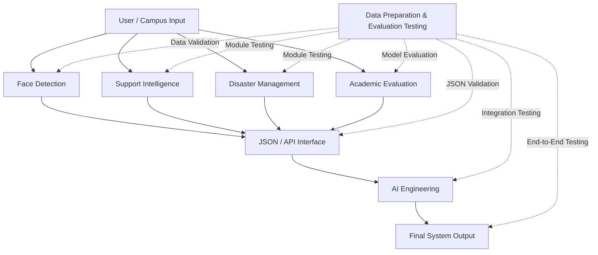

# Project Proposal

# AI-Powered Student Support and Smart Campus Intelligence System

## Data Preparation & Evaluation Testing Team

---

## 1. Project Overview

The **AI-Powered Student Support and Smart Campus Intelligence System** combines multiple AI-based modules to support students and improve smart-campus operations.

The project is divided into:

1. **Support Intelligence**
2. **Disaster Management**
3. **AI Engineering**
4. **Academic Evaluation**
5. **Face Detection**
6. **Data Preparation & Evaluation Testing**

Our team of **6 members** is responsible for the testing, validation, benchmarking, and evaluation of the individual modules and the final integrated system.

Our role is broader than checking model accuracy. We will act as the **quality assurance and evaluation layer** for the complete project, covering data quality, preprocessing, models, communication, integration, performance, reliability, and regression.

> **Note:** The methods and tools described in this proposal are proposed approaches. Actual datasets, models, APIs, thresholds, and implementation tools will be finalized during development.

---

# 2. Testing Objectives

The testing team aims to:

- Verify system correctness.
- Ensure dataset quality.
- Validate preprocessing.
- Evaluate model outputs using appropriate metrics.
- Detect errors at an early stage.
- Establish standardized benchmarks.
- Validate JSON/API communication.
- Verify module compatibility.
- Test complete system integration.
- Measure performance and reliability.
- Prevent regressions after changes.
- Track and document issues.
- Provide measurable evidence of system quality.

---

# 3. Overall Testing Pipeline

```text
Data
  ↓
Data Validation
  ↓
Preprocessing Validation
  ↓
Module & Model Testing
  ↓
Model Evaluation
  ↓
Benchmarking
  ↓
JSON/API Validation
  ↓
Integration Testing
  ↓
End-to-End Testing
  ↓
Performance & Reliability Testing
  ↓
Regression Testing
  ↓
Final System Evaluation
```

---

# 4. Dataset & Preprocessing Testing

Dataset and preprocessing validation will be performed before model evaluation.

## 4.1 Dataset Testing

The team will check datasets for:

- Missing values.
- Duplicate records.
- Invalid values.
- Incorrect data types.
- Incorrect labels.
- Class imbalance.
- Outliers.
- Inconsistent formats.
- Data distribution.
- Data leakage.
- Train/validation/test contamination.
- Data completeness and consistency.

## 4.2 Preprocessing Testing

The team will verify:

- Correct preprocessing operations.
- Normalization/scaling.
- Encoding.
- Missing-value handling.
- Consistent processing between training and testing.
- Absence of test-data leakage.
- Correct expected input format.

A dataset quality report will record the validation results.

| Check | Result | Status |
|---|---|---|
| Missing Values | `[Result]` | Pass/Fail |
| Duplicates | `[Result]` | Pass/Fail |
| Invalid Values | `[Result]` | Pass/Fail |
| Labels | `[Result]` | Pass/Fail |
| Class Distribution | `[Result]` | Pass/Fail |
| Data Leakage | `[Result]` | Pass/Fail |
| Preprocessing | `[Result]` | Pass/Fail |
| Overall Quality | `[Result]` | Pass/Fail |

---

# 5. Module & Model Testing

Each module will first be tested independently:

- Support Intelligence
- Disaster Management
- AI Engineering
- Academic Evaluation
- Face Detection

## 5.1 Functional Testing

For every module, test cases will cover:

- Valid inputs.
- Invalid inputs.
- Missing inputs.
- Boundary conditions.
- Edge cases.
- Expected outputs.
- Unexpected outputs.
- Error handling.

## 5.2 Model Evaluation

Metrics will be selected according to the task rather than applying every metric to every model.

| Task | Possible Metrics |
|---|---|
| Classification | Accuracy, Precision, Recall, F1-score |
| Imbalanced Classification | Precision, Recall, F1-score, Confusion Matrix |
| Binary Classification | Accuracy, Precision, Recall, F1-score, ROC-AUC |
| Regression | MAE, MSE, RMSE |
| Real-Time Module | Response Time, Processing Time, Failure Rate |

Where applicable, model evaluation will also consider prediction errors and resource usage.

---

# 6. Benchmarking

## 6.1 Purpose

Benchmarking provides a standardized way to compare module performance.

The testing team will create a benchmark suite containing:

- Predefined datasets.
- Standard test cases.
- Expected outputs.
- Evaluation metrics.
- Pass/fail criteria.
- Performance requirements.

The benchmark can be rerun whenever a module changes.

## 6.2 Proposed Benchmark Score

| Category | Weight |
|---|---:|
| Functional Correctness | 20% |
| Input Handling | 10% |
| Output Accuracy | 20% |
| Data Compatibility | 10% |
| Performance | 10% |
| Reliability | 10% |
| Error Handling | 5% |
| Integration | 10% |
| Regression | 5% |
| **Total** | **100%** |

These weights are **proposed** and may be changed according to the final requirements of the project.

---

# 7. Test Case Framework

A common test-case structure will be maintained for all modules.

Test cases will include:

- Normal cases.
- Boundary cases.
- Invalid inputs.
- Missing data.
- Edge cases.
- Stress/load cases where applicable.
- Integration cases.
- Regression cases.
- Security/privacy validation where appropriate.

| Test ID | Module | Input | Expected Output | Actual Output | Status | Severity |
|---|---|---|---|---|---|---|
| TC-001 | Support Intelligence | Valid query | Correct response | `[Actual]` | Pass/Fail | Low |
| TC-002 | Face Detection | No face | Appropriate response | `[Actual]` | Pass/Fail | Medium |
| TC-003 | Academic Evaluation | Missing ID | Validation error | `[Actual]` | Pass/Fail | High |
| TC-004 | Disaster Management | Emergency event | Appropriate alert | `[Actual]` | Pass/Fail | Critical |
| TC-005 | Any Module | Invalid data type | Error response | `[Actual]` | Pass/Fail | High |

---

# 8. JSON/API & Interface Testing

The different modules will eventually communicate with each other. A standard JSON-based interface will therefore be proposed.

## 8.1 Example JSON Message

```json
{
  "student_id": "STU001",
  "query": "When is the next internal exam?",
  "category": "academic",
  "response": "The next internal exam is scheduled for...",
  "confidence": 0.94,
  "source": "academic_module"
}
```

Actual fields will be finalized with the module teams.

## 8.2 JSON Validation

The testing team will verify:

- Required fields.
- Missing fields.
- Extra fields.
- Data types.
- Valid values.
- Null values.
- Invalid values.
- JSON syntax.
- Field naming.
- Schema compatibility.
- Data loss during transfer.
- Correct interpretation by receiving modules.

## 8.3 Proposed JSON Schema

```json
{
  "$schema": "https://json-schema.org/draft/2020-12/schema",
  "title": "Student Support Message",
  "type": "object",
  "required": [
    "student_id",
    "query"
  ],
  "properties": {
    "student_id": {
      "type": "string",
      "minLength": 1
    },
    "query": {
      "type": "string",
      "minLength": 1
    },
    "category": {
      "type": "string"
    },
    "response": {
      "type": "string"
    },
    "confidence": {
      "type": "number",
      "minimum": 0,
      "maximum": 1
    },
    "source": {
      "type": "string"
    }
  },
  "additionalProperties": false
}
```

Schema validation can automatically detect invalid structures before data reaches another module.

---

# 9. Integration & End-to-End Testing

After individual modules pass their tests, the testing team will verify their interaction.

## 9.1 Integrated System Overview

```text
                         USER / CAMPUS INPUT
                                  │
          ┌───────────────────────┼────────────────────────┐
          │                       │                        │
          ▼                       ▼                        ▼
   Face Detection        Support Intelligence      Disaster Management
          │                       │                        │
          │                       │                        │
          └───────────────┬───────┴───────────────┬────────┘
                          │                       │
                          ▼                       ▼
                  Academic Evaluation       Other AI Modules
                          │                       │
                          └───────────┬───────────┘
                                      │
                                      ▼
                              JSON / API Interface
                                      │
                                      ▼
                                AI Engineering
                                      │
                                      ▼
                             Integrated System
                                      │
                                      ▼
                              FINAL OUTPUT
                                      │
                                      ▼
                     DATA PREPARATION & EVALUATION
                              TESTING LAYER
```

## 9.2 Integration Checks

The team will verify:

- Data transfer.
- API/interface compatibility.
- JSON compatibility.
- Input/output compatibility.
- Missing or incorrect fields.
- Data-type mismatches.
- Unexpected outputs.
- Communication failures.
- Module failure handling.
- Information loss.
- Response propagation.

## 9.3 End-to-End Testing

The complete workflow will be tested as:

```text
User Input
    ↓
Appropriate Module
    ↓
Processing
    ↓
Module Communication
    ↓
Final Output
```

Scenarios will include:

- Student asks an academic question.
- Student identity is detected.
- Academic evaluation is requested.
- Emergency event occurs.
- Invalid input is provided.
- A module produces invalid output.
- A module becomes unavailable.

---

# 10. Data Flow Diagram



---

# 11. Performance, Reliability & Error Testing

These related tests will be handled together because they all evaluate system behavior under normal and abnormal operating conditions.

## 11.1 Performance

Where applicable, measure:

- Response time.
- Processing time.
- Throughput.
- Memory usage.
- CPU/GPU usage.
- Failure rate.
- Stability under repeated requests.

Stress/load testing may be performed for modules where increased workload is relevant.

## 11.2 Reliability

Test whether the system behaves consistently when:

- The same input is repeated.
- Similar inputs are provided.
- Multiple requests occur.
- Invalid inputs occur.
- A dependent module fails.

## 11.3 Error Handling

Test:

- Invalid input.
- Missing input.
- Wrong data type.
- Malformed JSON.
- Missing JSON fields.
- Model failure.
- API failure.
- Timeout.
- Unexpected output.
- Module unavailability.

The system should fail safely, prevent invalid data from propagating, and provide meaningful error information.

---

# 12. Regression Testing

Regression testing will be performed whenever a team changes:

- Model architecture.
- Dataset.
- Preprocessing.
- API.
- JSON structure.
- Output format.
- Features.
- Bug fixes.

The process will be:

```text
Change
 ↓
Run Previous Tests
 ↓
Compare Results
 ↓
Identify New Failures
 ↓
Fix
 ↓
Retest
 ↓
Update Benchmark
```

Regression testing ensures that new changes do not break previously working functionality.

---

# 13. Quality Gates

Quality gates will determine whether a module is ready for the next stage.

### Dataset Quality Gate

- No critical missing data.
- No unintended duplicates.
- Valid labels.
- Correct schema.
- No data leakage.

### Model Quality Gate

- Meets agreed benchmark threshold.
- Acceptable task-specific metrics.
- No critical test failures.

### Integration Quality Gate

- JSON Schema validation passed.
- Required fields available.
- Data transfer successful.
- Critical integration tests passed.

### Final System Quality Gate

- End-to-end tests passed.
- No unresolved critical issues.
- Regression tests passed.
- Benchmark results documented.

Exact thresholds will be finalized with the project guide.

---

# 14. Issue Tracking

All issues will follow a common format.

| Issue ID | Module | Description | Severity | Expected | Actual | Status |
|---|---|---|---|---|---|---|
| ISS-001 | `[Module]` | `[Description]` | High | `[Expected]` | `[Actual]` | Open |

Severity levels:

- **Critical** — Prevents major system operation.
- **High** — Significantly affects important functionality.
- **Medium** — Affects functionality but does not stop operation.
- **Low** — Minor impact.

Issue lifecycle:

```text
Detected → Reported → Assigned → Fixed → Retested → Closed
```

---

# 15. Test Result Reporting

A standard report will be maintained for each testing cycle.

It will include:

- Total test cases.
- Passed.
- Failed.
- Blocked.
- Pass percentage.
- Benchmark score.
- Relevant model metrics.
- Performance results.
- Critical issues.
- Regression status.
- Integration status.
- Overall status.

## Example

| Parameter | Result |
|---|---:|
| Total Test Cases | 100 |
| Passed | 88 |
| Failed | 8 |
| Blocked | 4 |
| Pass Percentage | 88% |
| Benchmark Score | `[Score]` |
| Critical Issues | 0 |
| Regression Status | Pass/Fail |
| Integration Status | Pass/Fail |
| Overall Status | `[Status]` |

> The values above are examples of report formatting only and are **not actual project results**.

---

# 16. GitHub Repository Structure

```text
data-preparation-evaluation/
│
├── README.md
├── PROJECT_PROPOSAL.md
│
├── datasets/
│   ├── raw/
│   ├── processed/
│   └── benchmark/
│
├── schemas/
│   ├── json/
│   └── validation/
│
├── test_cases/
│   ├── functional/
│   ├── edge_cases/
│   ├── integration/
│   ├── performance/
│   └── regression/
│
├── benchmarks/
│   ├── benchmark_results/
│   └── evaluation_reports/
│
├── integration/
│   ├── data_flow/
│   └── interface_tests/
│
├── issues/
│   └── issue_records/
│
└── documentation/
    ├── dataset_documentation/
    ├── testing_documentation/
    └── final_report/
```

| Folder | Purpose |
|---|---|
| `datasets/raw/` | Original datasets |
| `datasets/processed/` | Validated/processed datasets |
| `datasets/benchmark/` | Benchmark datasets |
| `schemas/json/` | JSON Schema definitions |
| `schemas/validation/` | Schema validation resources |
| `test_cases/` | Different categories of tests |
| `benchmarks/` | Benchmark results and reports |
| `integration/` | Interface and data-flow testing |
| `issues/` | Bug and issue records |
| `documentation/` | Testing and project documentation |

---

# 17. Proposed Automation

The following are **proposed tools**, not tools already confirmed to be in use:

- Python.
- Pandas.
- NumPy.
- Scikit-learn.
- PyTest.
- JSON Schema validation.
- Git/GitHub.
- GitHub Actions/CI.

Potential automation areas include:

- Dataset validation.
- JSON validation.
- Automated test execution.
- Benchmark calculation.
- Regression testing.
- Test report generation.

Example dataset validation:

```python
import pandas as pd

df = pd.read_csv("[Dataset Name].csv")

print("Number of records:", len(df))
print("Missing values:")
print(df.isnull().sum())

print("Duplicate records:", df.duplicated().sum())

print("Data types:")
print(df.dtypes)
```

The actual implementation will depend on the selected datasets and system architecture.

---

# 18. Team of 6 Members

## Member 1 — Dataset & Data Quality

- Dataset validation.
- Cleaning verification.
- Missing-value and duplicate analysis.
- Label verification.
- Leakage checks.

## Member 2 — Model Testing & Evaluation

- Individual model testing.
- Model metrics.
- Prediction testing.
- Error analysis.

## Member 3 — Test Cases & Benchmarking

- Test-case development.
- Benchmark datasets.
- Benchmark scoring.
- Pass/fail criteria.

## Member 4 — JSON/API & Interface Testing

- JSON Schema.
- Data-format validation.
- API/interface compatibility.
- Inter-module data exchange.

## Member 5 — Integration & End-to-End Testing

- Module-to-module testing.
- Data-flow validation.
- Integration scenarios.
- Complete workflow testing.

## Member 6 — Performance, Regression & Reporting

- Performance testing.
- Reliability testing.
- Regression testing.
- Issue tracking.
- Evaluation reports.

Responsibilities may overlap, and **all six members will participate in final system testing and evaluation**.

---

# 19. Deliverables

The testing team will produce:

1. Dataset quality reports.
2. Test-case repository.
3. Benchmark dataset.
4. Benchmark results.
5. JSON Schemas.
6. JSON validation tests.
7. Module testing reports.
8. Integration testing reports.
9. Performance testing reports.
10. Regression testing reports.
11. Issue/bug reports.
12. Final evaluation report.

---

# 20. Important Terminology

| Term | Simple Meaning |
|---|---|
| **Testing** | Checking whether the system behaves as expected |
| **Validation** | Checking whether the system meets its intended requirements |
| **Verification** | Checking whether the system was built correctly |
| **Benchmarking** | Evaluating using a standardized set of tests and criteria |
| **Evaluation** | Measuring and analyzing system performance |
| **Unit Testing** | Testing an individual component |
| **Integration Testing** | Testing multiple components together |
| **End-to-End Testing** | Testing the complete workflow |
| **Regression Testing** | Repeating tests after changes |
| **Dataset Validation** | Checking dataset quality and correctness |
| **JSON Schema Validation** | Checking JSON structure and data types |
| **Performance Testing** | Measuring speed, throughput, and resource usage |
| **Edge-Case Testing** | Testing unusual or boundary inputs |

---

# 21. Expected Outcome

The testing team will provide an independent quality layer that helps ensure the final system is:

- **Correct**
- **Reliable**
- **Robust**
- **Consistent**
- **Measurable**
- **Compatible**
- **Maintainable**
- **Ready for integration**
- **Ready for demonstration**

The team will provide evidence of system quality rather than relying only on individual model accuracy.

---

# 22. Conclusion

The **Data Preparation & Evaluation Testing Team** is essential to the overall project because the quality of an AI system depends on much more than model accuracy.

Our team will validate the complete system from **raw data to final output**, including datasets, preprocessing, individual models, benchmarks, JSON communication, integration, performance, reliability, error handling, and regression.

The proposed testing framework will provide a systematic method for identifying problems early, measuring system performance, verifying module compatibility, and documenting the readiness of the final system.

Ultimately, the team will help ensure that the **AI-Powered Student Support and Smart Campus Intelligence System** is not only functional, but also **reliable, robust, measurable, compatible, and ready for integration and demonstration**.

---

## Project Proposal Status

| Item | Status |
|---|---|
| Project | AI-Powered Student Support and Smart Campus Intelligence System |
| Team | Data Preparation & Evaluation Testing |
| Team Size | 6 Members |
| Primary Role | Testing, Benchmarking, Validation & Evaluation |
| Dataset Testing | Proposed |
| Model Testing | Proposed |
| Benchmarking | Proposed |
| JSON/API Testing | Proposed |
| Integration Testing | Proposed |
| End-to-End Testing | Proposed |
| Performance Testing | Proposed |
| Regression Testing | Proposed |
| Automation | Proposed |
| Final Evaluation | Planned |
