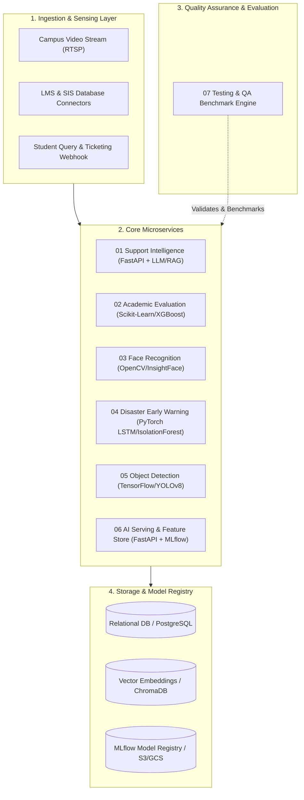

# System Architecture & Technical Specifications

## 1. High-Level Architecture Overview

The **AI-Powered Student Support & Smart Campus Intelligence System** is structured into independent, highly cohesive microservices interconnected through asynchronous message channels and RESTful/gRPC API interfaces.

---

## 2. Microservice Topology & Responsibilities

### 01 Support Intelligence (`01_support_intelligence`)
- **Role**: Automated student query handling, ticket classification, intent recognition, and critical attendance/risk escalation.
- **Tech Stack**: Python, FastAPI, Hugging Face Transformers, LangChain/LlamaIndex, PostgreSQL.
- **Interfaces**: REST API endpoints for chatbot interaction and automated email/SMS escalation alerts.

### 02 Academic Evaluation (`02_academic_evaluation`)
- **Role**: Longitudinal academic trajectory modeling, grade forecasting, weak subject identification, and personalized recommendation generation.
- **Tech Stack**: Python, Pandas, Scikit-Learn, XGBoost, FastAPI.
- **Interfaces**: Batch prediction APIs, student risk score endpoints.

### 03 Face Recognition (`03_face_recognition`)
- **Role**: Contactless biometric attendance logging, lecture hall occupancy validation, and authorized personnel verification.
- **Tech Stack**: OpenCV, InsightFace/FaceNet, PyTorch, SQLite/PostgreSQL.
- **Interfaces**: Stream ingestion endpoints, daily attendance roll generators.

### 04 Disaster Management & Early Warning (`04_disaster_management`)
- **Role**: Multi-factor academic disaster prevention (mass failure spikes, sudden disengagement clusters, dropout probability detection).
- **Tech Stack**: PyTorch (LSTM/Autoencoders), Isolation Forest, Streamlit dashboard.
- **Interfaces**: Real-time anomaly webhooks, administrative warning feeds.

### 05 Object Detection (`05_object_detection`)
- **Role**: Smart campus monitoring, perimeter awareness, classroom asset tracking, and capacity utilization analytics.
- **Tech Stack**: TensorFlow / Keras, YOLOv8/SSD MobileNet, OpenCV.
- **Interfaces**: Frame-by-frame inference pipeline, bounding box metadata publisher.

### 06 AI Engineering & Serving (`06_ai_engineering`)
- **Role**: Centralized feature store, low-latency asynchronous model gateway, MLflow experiment tracking, and model drift monitor.
- **Tech Stack**: FastAPI, Docker, MLflow, Redis, Prometheus.
- **Interfaces**: Core gateway for downstream prediction requests.

### 07 Testing & QA (`07_testing_and_qa`)
- **Role**: Automated dataset validation, model drift stress-testing, synthetic test generation, latency profiling, and regression suites.
- **Tech Stack**: PyTest, Locust, DeepEval, Great Expectations.
- **Interfaces**: CI/CD automated test runners and benchmark reporting dashboard.

---

## 3. Communication Protocols & Security
- **Internal Microservice Calls**: Asynchronous HTTP/REST with JSON payloads and gRPC for high-throughput tensor exchange.
- **Data Privacy**: Biometric embeddings and student PII are encrypted at rest (AES-256) and hashed in transit.
