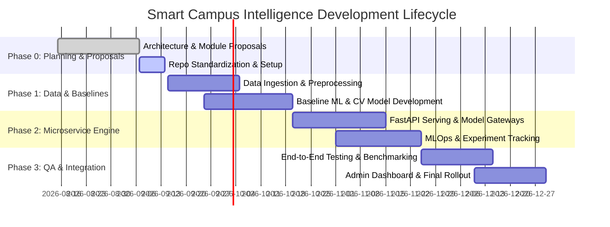

# Project Roadmap & Milestones

## Phase Timeline Overview

---

## Detailed Milestone Checklist

### Phase 0: Architecture & Proposal Sign-off (Current)
- [x] Master engineering specification authored (`docs.md`).
- [x] Sub-module technical proposals drafted and consolidated (`01` through `07`).
- [x] Repository hygiene, `.gitignore`, directory scaffolding, and contribution standards established.
- [ ] Cross-module API schema agreement (Swagger / Pydantic models).

### Phase 1: Data Engineering & Baseline Modeling
- [ ] Synthetic and scrubbed campus dataset collection.
- [ ] Exploratory Data Analysis (EDA) notebooks checked into `notebooks/`.
- [ ] Baseline model training:
  - NLP intent classifier (Support Intelligence).
  - GPA Regressor & Failure Classifier (Academic Evaluation).
  - Face extraction & embedding pipeline (Face Recognition).
  - Anomaly autoencoder (Disaster Management).
  - Object detection bounding box pipeline (Object Detection).

### Phase 2: Microservice Architecture & Serving
- [ ] FastAPI microservices scaffolding in `services/`.
- [ ] Centralized feature store & model serving gateway (`06_ai_engineering`).
- [ ] Containerization with Docker for each independent service.
- [ ] MLflow model registry and metric tracking setup.

### Phase 3: QA Benchmarking & Deployment
- [ ] Unit and integration test suites in `tests/`.
- [ ] Load testing with Locust (< 100ms latency target).
- [ ] User Interface (Admin Dashboard & Student Portal) integration.
- [ ] Final demonstration and release documentation.
