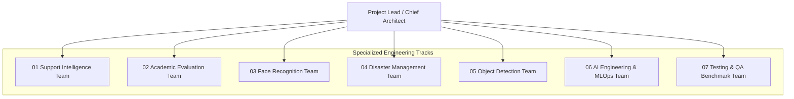

# Team Structure & Department Governance

## 1. Leadership & Organizational Hierarchy

---

## 2. Department Mandates & Responsibilities

| Module / Track | Primary Focus | Key Responsibilities |
| :--- | :--- | :--- |
| **00 Project Management** | Cross-team coordination | Repository governance, roadmap tracking, code review coordination, release management. |
| **01 Support Intelligence** | NLP & Conversational AI | Query classification, student ticket routing, attendance risk escalation logic, chatbot API. |
| **02 Academic Evaluation** | Predictive ML Analytics | Student trajectory modeling, grade forecasting, weak area diagnostic algorithms. |
| **03 Face Recognition** | Biometric Computer Vision | Face detection, embedding generation, contactless attendance logging, CCTV stream processing. |
| **04 Disaster Management** | Anomaly & Crisis Detection | ADM-EWS engine, anomaly detection for retention drops, bulk academic failure early warning. |
| **05 Object Detection** | Vision Surveillance | Spatial resource utilization, classroom occupancy counting, facility and perimeter monitoring. |
| **06 AI Engineering** | MLOps & Distributed Serving | FastAPI prediction gateway, MLflow model tracking, drift detection, containerization. |
| **07 Testing & QA** | Verification & Benchmarking | Test suite implementation (unit/integration), dataset validation, latency profiling, QA sign-off. |

---

## 3. Communication & Code Review Protocols
- **Daily / Weekly Syncs**: Department leads sync on interface definitions and schema updates.
- **Code Ownership**: Module code must be reviewed by the assigned CODEOWNER before merging into `main`.
- **Cross-Team Dependencies**: Any API schema modifications must be communicated to the AI Engineering (`06`) and Testing (`07`) teams.
